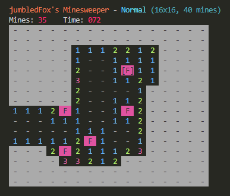

# Terminal Minesweeper

A terminal minesweeper game, made in Rust in a few days

God, it's so janky, I'd like to remake it with a plan next time, as this time I sort of just went with the flow..

For different difficulties, use the arguments `easy`, `normal`, or `hard`.

For custom settings, use the arguments `width height bomb_count`!!! (e.g. `minesweeper.exe 50 50 400` for a really long game)
